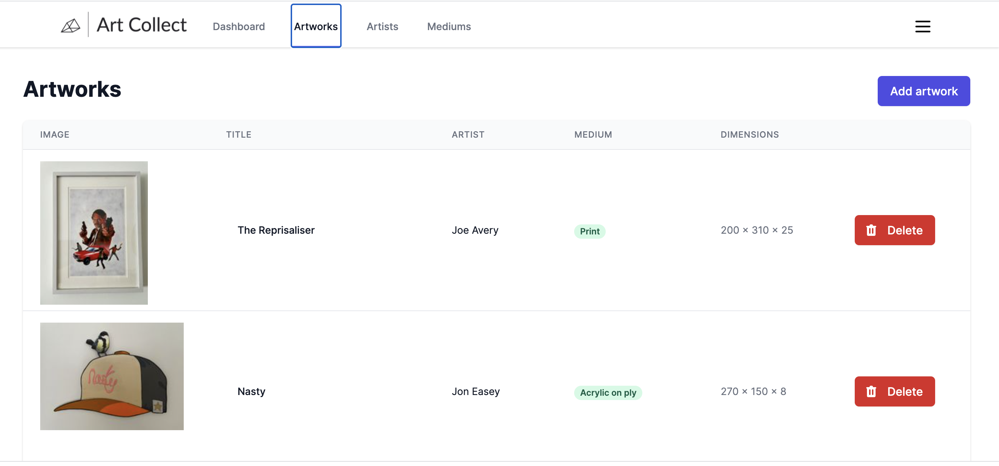

# Artwork collection management database

This project was built as the final part of CodeClan's Professional Software Development course. We were given free rein to build an app using whatever tech stack we liked, so I decided to build it using React with Tailwind CSS for the front end and AWS serverless technologies for the back end.

The app allows a user to add and delete artists, artworks and mediums to the database, as well as upload images. Functionality is minimal at the moment, but I hope to expand on this in the future.

The data is held in DynamoDB and accessed via AppSync with GraphQL queries. Images are held on S3 with Lambda used to process them into thumbnails on upload. Authentication is handled by Cognito. Everything is tied together with Amplify.

## Usage

You can see the app live at https://www.art-collect.net

To install for your self:

- Download/clone this repository
- Cd to the project folder and run `npm install`
- Download the AWS Amplify CLI
- Run `amplify init` from the project folder to configure Amplify and create the Amplify resources
- Run `amplify push` to push these resources to your AWS account
- Run `npm start` to start the local development server

## Future refinements/fixes

Progress on this project was hampered by having to learn many new technologies (AWS, Tailwind, GraphQL) in the 10 days I had to build it - I hope to continue working on this, and will probably rebuild it from the ground up as I learn about each system in more depth.

Future plans include:

- Add editions/prints
- Edit records
- Much better image handling
- Comprehensive search system
- Searchable form fields
- Other artwork fields and data - notes, sales, location, loans
- Different views to show data
- Sorting and filtering
- QR code label/shipping label generation
- Dark mode
- Pagination of results
- Import/export functionality
- Significant UI improvements and tweaks
- Synchronisation and live updates
- Multiple users /w permission levels
- Bulk actions
- PDF exports
- Recycle bin for delete
- Social providers login
- Analytics
- Use Typescript

